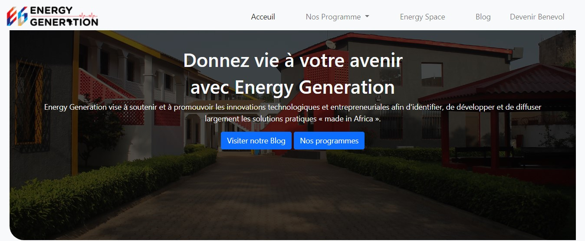

# REFONTE DU SITE DU CAMPUS ENERGY GENERATION

## Contexte du projet: 
Sur une base de *collaboration* entre Dev Web, Energy generation nous demande de faire la refonte de leur site web afin de le rendre plus attrayant et plus responsif.

## Situation de départ :
- [Lien du site Web] (https://www.energy-generation.org/)
- Quelques images du site:

- Durée du projet : **2 semaines**

## Critère de perfomace après refonte:
- Le site web est responsif
- Le site web présente une meilleure expérience utilisateur
- Un projet propre, bien structuré et commenté
- Le respect des bonnes pratiques dans l'utilisation de git
- Une base de données fonctionnelle 
- la création d'un formulaire pour les inscriptions sur la page 
- la présence d'une newsletter pour les inscriptions sur les pages

## Outils utilisés :
- **languages:** php, HTML, CSS
- **Outil de maquettage :** Figma

## The Team:
Notre équipe est composée des membres suivants (leur nom github et lien vers leur repo):
- @El-Tawfik17 ; 
Visitez son repo! :point_right: https://github.com/El-Tawfik17
- @SAMIE228 ; 
Visitez son repo! :point_right: https://github.com/SAMIE228
- @ivypel98 ; 
Visitez son repo! :point_right: https://github.com/ivypel98

## Resultat :
vous retrouverez sur notre repo collaboratif Github (https://github.com/El-Tawfik17/Brief_projet_EG), les livrables suivants:

1. Kanban board réalisé avec Github,
2. Maquette en format PDF réalisée à l'aide du logiciel Figma
3. Schéma de la base de données incluant les cardinalités (diagramme UML)
4. L'exportation de la base de données dans un fichier sql 
5. Hébergement du site web sur une solution gratuite *000Webhost*

   Vos contributions sont les bienvenues
    Merci ;)

